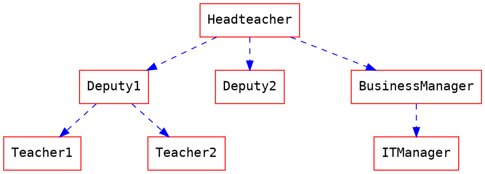

+++
title = 'New'
date = 2023-09-29T23:40:42+08:00
draft = false
+++


#  基本語法
##  1. 設定標題
#第一層級標題
##第一層級標題
###第一層級標題
####第一層級標題
#####第一層級標題
######第一層級標題

##  2. 階層清單
加上項目編號，將項目縮排即可作為子清單。
清單分為有序清單與無序清單兩種。
有序清單，是項目符號會使用數字編號；無序清單，是項目符號會使用同樣的層級的符號。

- 無序清單
    - Deutsch 
        - Guten Tag!
        - Gete Nacht!
        
1. 有序清單
    1. 有序清單子清單
        2. 有序清單子子清單

##  3. 引用區塊
請在行首輸入 > 符號，並在後面加上一個空白後，再輸入引用文字，即可形成引用區塊。
如在引用區塊前多次輸入 > 符號，即是子引用區塊。
> 引用
> >子引用
> >>子子引用1.
> >>子子引用2.

## 4. 粗體、斜體
請在文字兩端加上 * 符號，即可將文字變成粗體或是斜體
使用一個 * 為斜體；使用兩個 * 為粗體。

*斜體*
**粗體**
## 5. 插入圖片
先輸入  這些文字，然後在後面的 () 中間插入圖片的網址，即可加入圖片。
![](data:image/png;base64,iVBORw0KGgoAAAANSUhEUgAAAOEAAADhCAMAAAAJbSJIAAAAhFBMVEX///8zMzMAAAA1NTUvLy8sLCwXFxchISH8/Pzj4+OpqaknJydkZGTb29s4ODjs7OyEhIQUFBR2dnZPT09ra2v19fUNDQ3AwMBCQkIjIyOVlZWzs7OsrKwbGxubm5vQ0NBXV1dfX1/IyMhNTU1xcXGOjo66urqgoKB/f39OTk5FRUWIiIimh3OHAAALf0lEQVR4nO2cC3uiPBOGyYRwMALFShQVj1X81v///74JZxHU2u72pdfc19b1gJDHmcxMQsAwCIIgCIIgCIIgCIIgCIIgCIIgCIIgCIIgCIIgCIIgCOJfEKwnfUzTn27cd7CxIewhgSluEDg/3cQvgG2Ppopx5vMufDXBjWZ/frqZX8JxE8FQYiccFTpo5Hn00818HcdwbcF5j0ae2XAj1G7AEg03FlpLp8RSIYP5TzfzC6ANu120qZCrATvqMwpNfDZcR31GofZgNc9C7wB5ykt1Px2soz5rQ7TiQB31uUiTvRxoRH3OS4uX2lEH1xmfVqjLAkBHdYYm8al+yLOyhw/TUZ+yoYkvTP3ABhhRHyvcwxWH4Keb/EkeK4y8K/a/SmE46fnWkKLNXYVyOyQpPdxTyMxw1fUdxxiSFe8oxBwhYH6atTjNhqTvgQ0RG27YDkpgW2FzIorlf6ye5MgSvz02BmXEpkJuSvuWBP9kuUWpcEA0FZrWtHtm+LxNcgsOWyFnyTnqA0z+C2zIw/5JfBWX/XG4Cjnz1bpzEx1VQP4GG7J43BciHTB/Q6TBjnib/Aok+w025DpdSCnwXwtpFtPig1aYK/C74D7nv8GGHC2YJNYNYWIlShTyBq2QMfm+bJfZZbUN6MG/wIZhd7bQFKFm2ArZfYX+8L0Uk8WidzO04fAVMi7YZdHBerE+K844G3jlrcd+QvUk/JCZnA1dYdb+znSoM2LpokNWmLU/tqwEc2LSBF9ZsrDgwBVyEe+m0/H0mjEy3Vm/oGrDjmifezcDMfyqDRvfnQ8d/S/L+AP3Umy71ZPxnd8xAkYDxTsvcLsINnqeZvj9kJnJvJuDkHXAHa7CXGQ31ZTw0BU+hBT+FyGFpPC/jxuLviXCPRqHpTBfBd2zRLhHYbz76VZ/DlRo8ucV4pYJKnQGtPYrGoco0GddVyN0gBLh8tNt/iQbC6zwdh64h8QCli0ZGooNdTvd4/gzrFz81lD0EQRBEARBEMS30V8EO/c/vk/kRFHPdzuWeTvl418tybt2/vKac2d8Pn/sb0YRhZKbwUVxnNYH+TtfprGPq705pQ1fGOvgPsGyYdXx8zgdh8oP07fpN9g13/vtfpyvOCqYHJY9h+t5967DfFHm/rJevLX3EqwX6+PypX3r02mm36XQMVy9OuO4v/3G6bhYL47FNUNRqtdw6E3TdLQ6uZ9vwzUpWArab3pCWdB3Wc9Dum2IQjZShSGMby9h24JSCrz8RTAHFSp9cw18D9R83L9U5ylGwM1bhT7z4e3VXfZ6qacXZpi5kqZ7zEJ9BUpYWCt4l7hVcd6K+2YCsC7md17y1z6F/K8o1LOKatEMnDoOrBW+baqGQjOWYWgBmjAx9eU3/uZlgf9cIedSH64ZxYOD1Ks5aoUxTyb6jLLneaM56FXUsbU3jBdjzj9WKHxpwub67Q2YwhcNGwpmTatPnTcZM/xZZsYwFIYraWY3dinBZxMltke7Vvg/yUuFmWduuMWYjF+9xvbfKuQwO4fmHx04apEgYLGyriJNMr363sFmDPpX7NznscKyFAmCoPoZr8uBKAqa90tqKrwqV1ChugSQfVq/fwIGTpo0Iw23rhRimhGch7NPi8t4wobYmGA2Ou8O28n6FNzUlbPR2/Qwfkv3ZWHSUKi9LDqdTstlsdtkGwhhvTULqY8QY89HLO4o1K3k6vhaef6MlwbnPyEkMpY2qMOmanp2uP17AkkcxzbY2yJlX9kQFWACz197nNvMOIbCduumunMTDfs/eUehrpMEE/Fr5c1DhU6wxYDNTRQoTJ/ZcCoOqv/cHdg8v9SC8QQu0Y0NsWjiLP+O3m2cGCd11U1HYIIbcMnu2dBYAPbEdr33TQpPEJrcBvB3Ox8SzkSyqbqh5yudyGA+3kqQTKisDVeRZmMLBhen2K1OhsFB2H51qGhiy23gxmYz0twqdHGn4cff8dJ9gsbxT66LkcabK86ScVR4aXBIGIo/6s/cDVYg+eK2psKA2cxiTrVbne4/FIaWqumhCSk+srv90HAx1sT25+X1KcS+UffDC+zqFH3A1FRm7Ox+beG27B3OW3GWvumlKmHJvLzRANpQ4LE8jKb5qVLUuQIuN9pE92JpZmombtr5vMLl6Jo1b0SaYNVwDVeZTJ3z1ulrRWxW3ychKirHQqEuPs/YfumVG+iaBrL1mMXV+vggY31y/5FCx1iHHZZ4ViEWve3V55h+CoUtx4+mNrdl/lzaaJL99eRDHWm03CXgFnXRnCvUYYPb+3zfESbDtTbrI4Uj7B/wUlmjFbLsAqzWSffOmsbR2xfeMkMT4jjhdi6ktCFuge1O61mmUiFarOiyxhtklnmg0MnbCS+lC51LWfsKAtVrQ2Opf8vsGXog06ZoTSDVNvRAcjg79UwMKsz0oCPIvHNG7zLZPlZofFGhCaflqslyZPIeG24uSdkfduik71F7DqtSaERbmyXvraott38KWWvRyhaHTfZjPKGQw0v3Rsl+m/ab7rxVteFxvdM01ObFwWrWHzy9uvuja5eFDSc3ey691HB9ZmWLh9ZK+loYKrxf0xip9p3vHD01soWTTRX9AV2c2YldKtxL/BWO/QqPOHLlsGh6caXQmCbZExSjslmYBwpxF0eLvR5LH9al+x0oKfSkQjKZxEVMQwfzofMadVSoZnt8FGjl5mi3VnjClLjPQo46PVaYlY4ynxz4GwqDKdhYjv6ZprobLFWlELcZ9SgU6zk2eZew+NAYC5YKswX8FtYHF1UkxgcKsaNiAkt84xUeKsTCG/1jOypauoRC4UbyzAk7FZq2ZHCMmNRpwWnsNrehY0xCc+4aShZ+/lDhBn1edfaJLyt0LgoFHquYuSoV4lCoqG5uFep1evCBhYhOnnUArL0UW8xg6UCZxB9GmnHIWXt+55sUeiCuTFUpxCECv1lN6ZQKubVDZQ5mFJ0wWl6qv72V1noN5SCjrTCp5mmKcQwOnuIXbxX2SOFR8atdVwoxHmIx5N0mfK2Qxyob5Ho66izbNU0W/cH0fVkMHHsVltXCGWt8SF+bMn2kcGs1rvhxmgoX4Oe1S0NgmfFNKOY3cfgRY3Fe1TTV+GAfc1OY5ZiwX2G+cTZl7L02nfhIoYx91YyYZSx1sGgWTBdfVV1a/l+OnvTrgEkcYNW7LSMN9iwbXflS+m9fP8x+tBkeSY8i/858qY+l16XW4OLYogwPHyEm/2ZtF1SVt6rG+CsdqDZthY6TF1PlZncUaoGSMWv76lm2RwqnIY7wqn64Z2FZ02RBKP9pS4G79hhfB4qDXcWIppfqlGjXY+O2wroc9MYKqyc7vDmf80WFZnnuSV96ZhVre70JxPoKhFyhHh3prLDd6JeRO8LCZ5Mr9BtzbTrYZFnP0aVs41jT98PRqL20UXnHvjVx8/sQTrCOYpyF89cyxR2FlQ2DLR7BMhej1egMobQWB5Er1PZZo0SWwHg9SicxCB8mkdGaiXKMC+R+6rRsaET1wORaoajvhBZiXcFjmLqv+qhW6HfM09Q2NPZ4EIZFqQJbKJgZ07geazspFnRMxAqUbWLrmZeN8ZnfnPN2BRZcLFfIr+Za6hleD3+F5lwb17cEzU4f+iIEtfrKfUFTbPqNwo1USp8Dzo6/5xALk5kS5BmPNMYv6ACanwP0xroox09FAvNiegmHWLBqLBBY6jf0SHijLdMUWNdz2l7FfI47x82z07/6zeR92r0m4Cn0ATbpaHRzhWuwSkdpdjpLb+Kud3gwa7vO+sIsTdOo/r6xXLwn6E3meVTYwEGfTb1qC0wrS/yKNkMwSpvHKs8C6APi8dLyPP4qTbP5MP243P/l27oWuS7ATu8GtaprAtf1XPfZlrzcnwiCIAiCIAiCIAiCIAiCIAiCIAiCIAiCIAiCIAiCIAiCIAiCIAiCIAiC+Eb+D5J7yIu5mK6HAAAAAElFTkSuQmCC)

## 6.嵌入影片
請先輸入 {} 這些文
在自動完成中選擇您的影片來源，可能是 youtube 或是 vimeo



##  7. 螢光比、色塊強調
a. 將文字，畫上螢光筆:在字串前後加上兩個等號==文字內容==
:::    success
b. 打上三個冒號 ::: 之後會自動出現「色塊」選項。上下各三個 ::: 之間的內容，就是色塊裡的內容。
:::

##  8.快速打出 Emoji
在編輯頁面，打一個冒號 : ，打上 emoji 的代碼，就可以即時搜尋到你想要使用的 emoji 符號。

##  9.在筆記中貼入程式碼
輸入‵‵‵ 後換行貼入程式碼，在結尾處也換行插入相同符號

## 10.利用Markdown撰寫數學式及圖表
[更多關於 **撰寫數學式及圖表** 語法 <i class="fa fa-external-link"></i>](https://hackmd.io/s/MathJax-and-UML-tw)
[more information form GitHub <i class="fa fa-external-link"></i>](https://docs.github.com/en/get-started/writing-on-github/working-with-advanced-formatting/creating-diagrams)
[more information <i class="fa fa-external-link"></i>](https://code.z01.com/doc/mdflow.html)
[Mermaid<i class="fa fa-external-link"></i>](http://mermaid.js.org/intro/)

### 流程圖
```flow
st=>start: 開始
e=>end: 結束
op=>operation: 我的操作
op2=>operation: 啦啦啦
cond=>condition: 是或否？

st->op->op2->cond
cond(yes)->e
cond(no)->op2
```
### 循環圖
```sequence
艾莉絲->包柏: 哈摟，你好嗎？
Note right of 包柏: 包柏思考中
包柏-->艾莉絲: 我很好，謝謝！
Note left of 艾莉絲: 艾莉絲回應
艾莉絲->包柏: 最近過得怎樣？
```

### Graphviz


##  11.數學公式、化學式
[more information <i class="fa fa-external-link"></i>](https://mhchem.github.io/MathJax-mhchem/)
